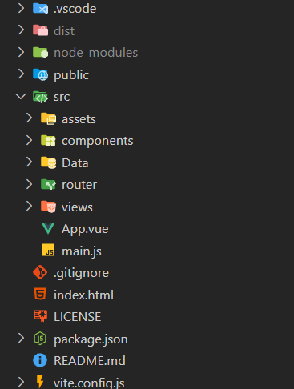

# Portfolio

## 1. Présentation du projet

Le projet "Portfolio", est une application web  frontend réalisée avec Vue.js.

Le but de l'application est de présenter les caractéristiques professionnelles de mr Nowak Benoît.

## 2. Architecture

Le site utilise l'architecture MVVM (model view viewmodel) de Vue.js

Le but est de maintenir un code simple, propre, efficace et de séparer le tout en "components" qui seront réutilisables - ex: la navbar.

## 3. Installation

Pour pouvoir utiliser le projet en local sur votre machine:

1. Avoir installé Node.js sur votre machine. 

2. Cloner le repo sur votre machine 
3. Se placer dans le dossier du repo sur votre machine puis ouvrir un terminal a partir de ce dernier
4. Utilisez la commande : `npm install`
5. Utilisez la commande : `npm run dev`
6. Utilisez le ctrl+click afin d'accéder en local au projet.

## 4. Annexes

Documentation HTML/CSS/JS : Consultez la [documentation officielle de MDN](https://developer.mozilla.org/fr/).

Hébergement: Gratuit (pour l'instant Vercel).

Accès au site : [Mon portfolio](https://portfolio-kohl-beta-23.vercel.app/)

## 5. Améliorations

- [X] Ajout du formulaire de contact 

- [] Optimisation des images

- [] Ajout d'un pannel administrateur pour l'ajout d'informations

## 6. Contact

Demande d'informations? Conseils? Amélioration?  N'hésitez pas à me contacter.
